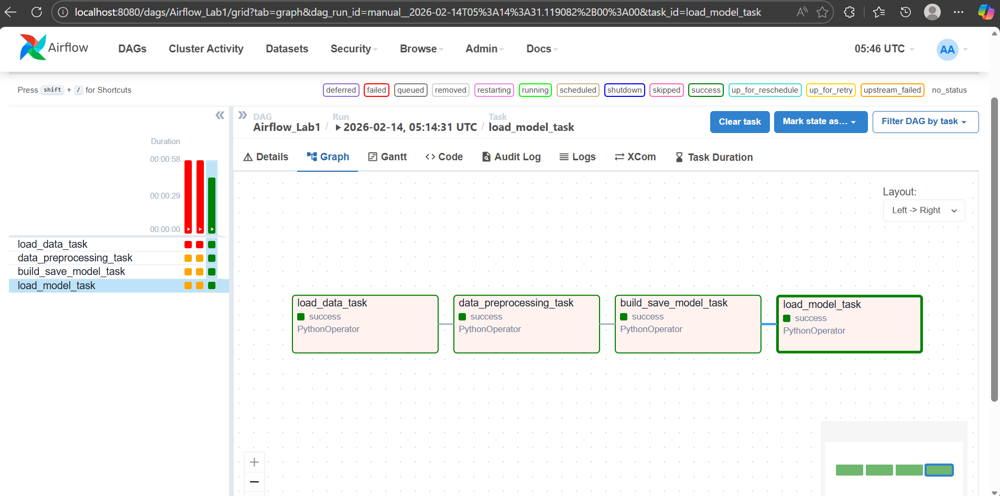
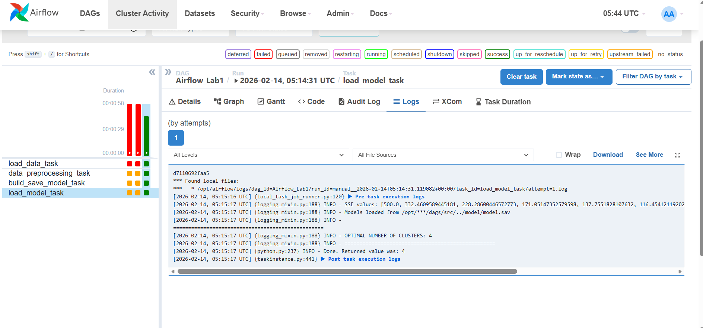
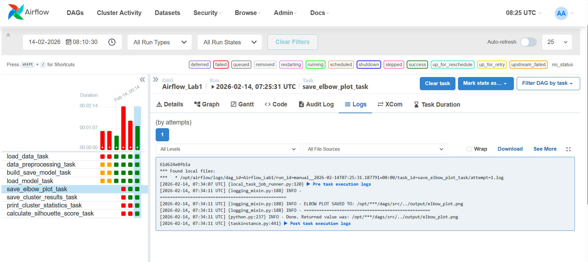
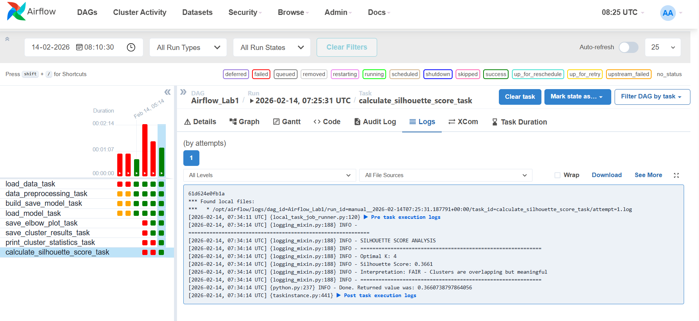
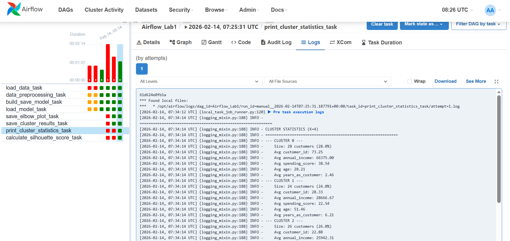
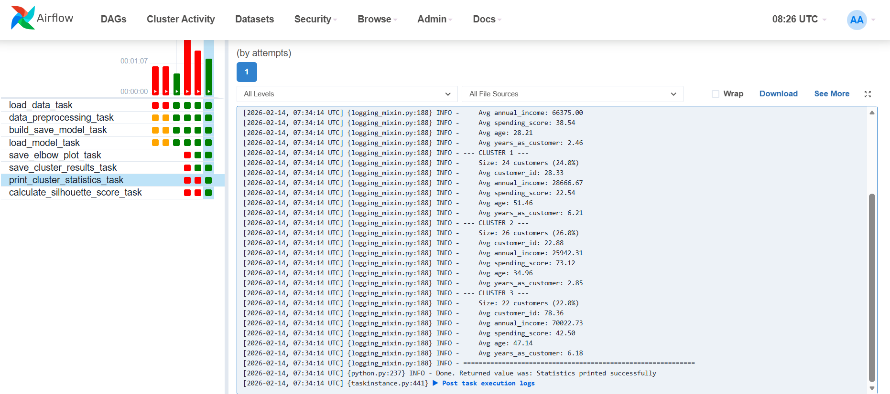
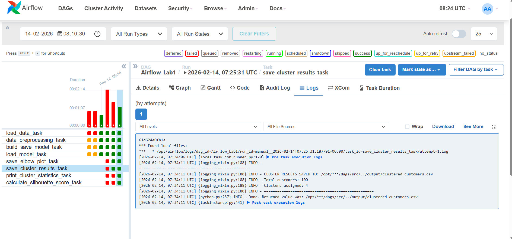

# Airflow Lab 1: K-Means Clustering Pipeline

**Course:** MLOps - Northeastern University  
**Author:** Sanjana Menon

---

## Project Overview

This project builds an automated machine learning workflow using Apache Airflow. The pipeline performs K-Means clustering on customer data and finds the optimal number of clusters using the Elbow Method.

Everything runs inside Docker containers, so you don't need to install Airflow directly on your computer. This makes it easy to run on Windows, Mac, or Linux.

---

## What Does This Pipeline Do?

The workflow has 6 tasks that run in sequence:

### Original Tasks (4 tasks):
1. **load_data_task** - Loads customer data from a CSV file (100 rows, 5 columns)
2. **data_preprocessing_task** - Cleans the data and scales the features using StandardScaler
3. **build_save_model_task** - Trains K-Means models for k=1 to k=10 and saves them
4. **load_model_task** - Uses the Elbow Method to find the best number of clusters

### ⭐ Extra Features Added (2 tasks):
5. **save_cluster_results_task** - Saves customers with their assigned cluster to a CSV file
6. **calculate_silhouette_score_task** - Calculates clustering quality using Silhouette Score

---

## Pipeline Results

| Metric | Value |
|--------|-------|
| Dataset Size | 100 customers, 5 features |
| K Values Tested | 1 to 10 |
| **Optimal Clusters** | **4** |
| **Silhouette Score** | **0.3661 (Fair)** |
| Output File | `clustered_customers.csv` |

---

## Screenshots

### 1. DAG Graph View - All Tasks Successful



This screenshot shows the Airflow Graph view after the pipeline finished running. All 6 tasks are green (success). The first 4 tasks run in sequence, then the last 2 tasks (extra features) run in parallel after the optimal number of clusters is determined.

---

### 2. Task Logs - Optimal Clusters Found



This screenshot shows the logs from the `load_model_task`. The SSE values for k=1 to k=10 are displayed, and the Elbow Method determined that **4 is the optimal number of clusters**.

---

### 3. Elbow Plot Visualization




This graph shows the Elbow Method visualization. The X-axis represents the number of clusters (K), and the Y-axis shows the Sum of Squared Errors (SSE). The red dashed line marks K=4, which is the "elbow point" where adding more clusters stops significantly reducing the error.

---

### 4. Silhouette Score Analysis



This screenshot shows the Silhouette Score analysis from the logs:
- **Optimal K:** 4
- **Silhouette Score:** 0.3661
- **Interpretation:** FAIR - Clusters are overlapping but meaningful

The Silhouette Score ranges from -1 to 1. A score of 0.3661 indicates that our clusters capture real patterns in the customer data, even though there is some overlap between clusters.

---

### 5. Cluster Statistics




This screenshot shows detailed statistics for each cluster:
- **Cluster size** - How many customers are in each cluster
- **Average values** - The mean of each feature (income, spending score, age, etc.) for customers in that cluster

This helps us understand the characteristics of each customer segment.

---

### 6. Clustered Customers Output (CSV)



This screenshot shows the output CSV file (`clustered_customers.csv`) with each customer assigned to a cluster (0, 1, 2, or 3). The new "cluster" column was added by our pipeline.

---

## ⭐ Extra Feature 1: Save Cluster Results to CSV

This feature assigns each customer to a cluster and saves the results to a new CSV file.

**What it does:**
- Takes the original customer data
- Uses the optimal K-Means model (k=4) to predict which cluster each customer belongs to
- Adds a new "cluster" column to the data
- Saves everything to `clustered_customers.csv`

**Output Location:** `dags/output/clustered_customers.csv`

**Log Output:**
```
==================================================
CLUSTER RESULTS SAVED TO: clustered_customers.csv
Total customers: 100
Clusters assigned: 4
==================================================
```

---

## ⭐ Extra Feature 2: Silhouette Score Analysis

This feature calculates the Silhouette Score to measure how well the clusters are separated.

**What is Silhouette Score?**
| Score Range | Meaning |
|-------------|---------|
| 0.7 to 1.0 | Excellent - Clusters are well defined |
| 0.5 to 0.7 | Good - Clusters have reasonable structure |
| 0.25 to 0.5 | Fair - Clusters are overlapping but meaningful |
| Below 0.25 | Weak - Clusters may not be well separated |

**Our Result:**
```
============================================================
SILHOUETTE SCORE ANALYSIS
============================================================
Optimal K: 4
Silhouette Score: 0.3661
Interpretation: FAIR - Clusters are overlapping but meaningful
============================================================
```

---

## DAG Structure
```
load_data_task
      ↓
data_preprocessing_task
      ↓
build_save_model_task
      ↓
load_model_task
      ↓
      ├── save_cluster_results_task (⭐ Extra Feature 1)
      └── calculate_silhouette_score_task (⭐ Extra Feature 2)
```

---

## Project Structure
```
airflow-lab1/
├── dags/
│   ├── data/
│   │   ├── file.csv              # Main dataset (100 customers)
│   │   └── test.csv              # Test dataset
│   ├── model/
│   │   └── model.sav             # Saved K-Means models
│   ├── output/
│   │   └── clustered_customers.csv  # ⭐ Output with cluster assignments
│   ├── src/
│   │   ├── __init__.py
│   │   └── lab.py                # ML functions (including extra features)
│   └── airflow.py                # DAG definition
├── images/                       # Screenshots for README
├── config/
├── logs/
├── plugins/
├── .env
├── .gitignore
├── docker-compose.yaml
└── README.md
```

---

## How the Elbow Method Works

The Elbow Method helps us find the best number of clusters:

1. We train K-Means with different values of k (1 to 10)
2. For each k, we calculate the SSE (how spread out the points are from their cluster centers)
3. We look for the "elbow" - where adding more clusters stops helping much
4. The KneeLocator library automatically finds this elbow point

**SSE Values from our run:**

| K | SSE | Note |
|---|-----|------|
| 1 | 500.00 | |
| 2 | 332.46 | |
| 3 | 228.29 | |
| **4** | **171.05** | **← Elbow Point (Optimal)** |
| 5 | 137.76 | |
| 6 | 116.45 | |
| 7 | 98.17 | |
| 8 | 84.92 | |
| 9 | 76.36 | |
| 10 | 69.55 | |

---

## Prerequisites

Before running this project, you need:

1. **Docker Desktop** installed and running
   - [Download for Windows](https://docs.docker.com/desktop/install/windows-install/)
   - [Download for Mac](https://docs.docker.com/desktop/install/mac-install/)
   - [Download for Linux](https://docs.docker.com/desktop/install/linux-install/)

2. At least **4GB of memory** allocated to Docker (I used 5GB)

### For Windows Users (WSL2)

If you're using Windows with WSL2, create a `.wslconfig` file to allocate enough memory:

1. Create a file at `C:\Users\YourUsername\.wslconfig`
2. Add this content:
```
   [wsl2]
   memory=5GB
   processors=2
```
3. Run `wsl --shutdown` in Command Prompt
4. Restart Docker Desktop

---

## Setup Instructions

### Step 1: Clone the Repository
```bash
git clone https://github.com/YOUR_USERNAME/airflow-lab1.git
cd airflow-lab1
```

### Step 2: Download docker-compose.yaml
```bash
# Mac/Linux
curl -LfO 'https://airflow.apache.org/docs/apache-airflow/2.9.2/docker-compose.yaml'

# Windows
curl -o docker-compose.yaml https://airflow.apache.org/docs/apache-airflow/2.9.2/docker-compose.yaml
```

### Step 3: Create the .env File
```bash
# Mac/Linux
echo -e "AIRFLOW_UID=$(id -u)" > .env

# Windows - create .env file with this content:
AIRFLOW_UID=50000
```

### Step 4: Edit docker-compose.yaml

Open the file and make these changes:
```yaml
# Don't load example DAGs
AIRFLOW__CORE__LOAD_EXAMPLES: 'false'

# Add required Python packages
_PIP_ADDITIONAL_REQUIREMENTS: ${_PIP_ADDITIONAL_REQUIREMENTS:- pandas scikit-learn kneed matplotlib}

# Change login credentials
_AIRFLOW_WWW_USER_USERNAME: ${_AIRFLOW_WWW_USER_USERNAME:-airflow2}
_AIRFLOW_WWW_USER_PASSWORD: ${_AIRFLOW_WWW_USER_PASSWORD:-airflow2}
```

### Step 5: Initialize the Database
```bash
docker compose up airflow-init
```

Wait until you see "airflow-init exited with code 0"

### Step 6: Start Airflow
```bash
docker compose up
```

Wait until you see the health check message.

### Step 7: Open Airflow UI

1. Go to http://localhost:8080
2. Login with:
   - Username: `airflow2`
   - Password: `airflow2`

### Step 8: Run the DAG

1. Find "Airflow_Lab1" in the DAGs list
2. Toggle the switch to turn it ON
3. Click the play button to trigger the DAG
4. Watch all 6 tasks turn green

### Step 9: Check the Results

| What to Check | Where to Find It |
|---------------|------------------|
| Optimal Clusters | `load_model_task` → Logs |
| Elbow Plot | `dags/output/elbow_plot.png` |
| Silhouette Score | `calculate_silhouette_score_task` → Logs |
| Cluster Statistics | `print_cluster_statistics_task` → Logs |
| Clustered Data | `dags/output/clustered_customers.csv` |

### Step 10: Stop Airflow
```bash
docker compose down
```

---

## Python Functions

### Original Functions:

| Function | Description |
|----------|-------------|
| `load_data()` | Reads CSV file and serializes it for Airflow |
| `data_preprocessing(data)` | Scales features using StandardScaler |
| `build_save_model(data, filename)` | Trains K-Means for k=1 to 10, saves models |
| `load_model_elbow(filename, sse)` | Finds optimal k using Elbow Method |

### ⭐ Extra Feature Functions:

| Function | Description |
|----------|-------------|
| `save_cluster_results(data, filename, optimal_k)` | Assigns clusters and saves to CSV |
| `calculate_silhouette_score(data, filename, optimal_k)` | Calculates clustering quality score |

---

## Technologies Used

- **Apache Airflow** - Workflow orchestration
- **Docker** - Containerization
- **Python** - Programming language
- **pandas** - Data manipulation
- **scikit-learn** - K-Means clustering, StandardScaler, Silhouette Score
- **kneed** - Elbow point detection
- **matplotlib** - Visualization

---

## What I Learned

1. How to set up Apache Airflow using Docker
2. Creating DAGs (Directed Acyclic Graphs) with task dependencies
3. Using PythonOperator to run ML functions
4. Passing data between tasks using XCom
5. K-Means clustering and the Elbow Method
6. Evaluating clustering quality with Silhouette Score
7. Troubleshooting memory issues with WSL2 and Docker

---

## References

- [Apache Airflow Documentation](https://airflow.apache.org/docs/)
- [Running Airflow in Docker](https://airflow.apache.org/docs/apache-airflow/stable/howto/docker-compose/index.html)
- [Prof. Ramin Mohammadi's MLOps Course](https://www.mlwithramin.com/blog/airflow-lab1)
- [K-Means Clustering - scikit-learn](https://scikit-learn.org/stable/modules/clustering.html#k-means)
- [Silhouette Score - scikit-learn](https://scikit-learn.org/stable/modules/clustering.html#silhouette-coefficient)

---

## License

This project is for educational purposes as part of the MLOps course at Northeastern University.
